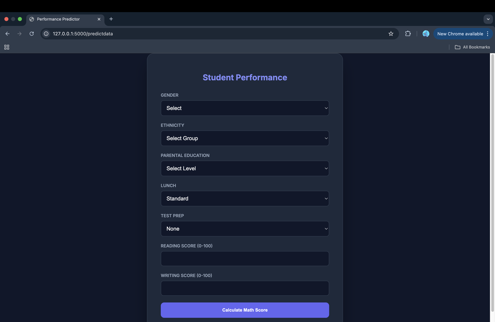
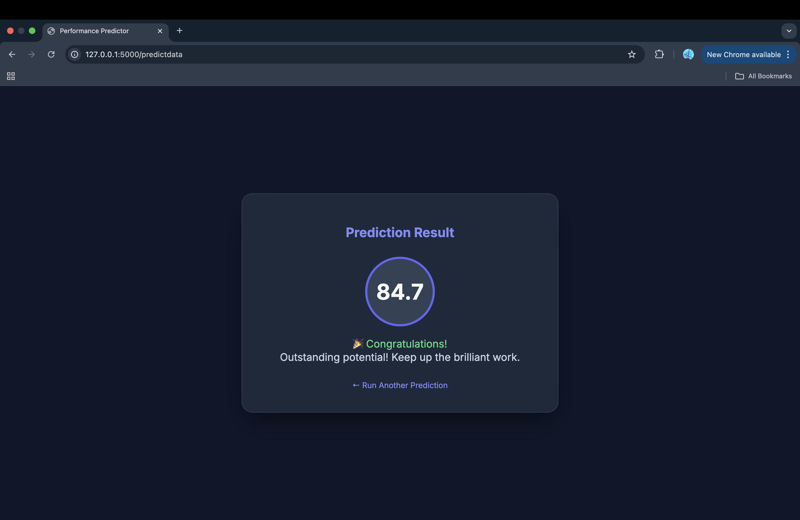

## Student Performance Predictor: End-to-End ML Pipeline 

The Student Performance Predictor is a production-grade machine learning application designed to forecast a student's mathematics score based on demographic and academic performance data. Features like gender,race ethnicity,parental level of education,test preparation course,reading score,writing score

Unlike simple notebooks, this project follows a modular, industrial-standard software engineering approach. It bridges the gap between research (Jupyter Notebooks) and production (Python Scripts & Web API), making it an ideal reference for Data Analysts and Software Engineers transitioning into ML Engineering.

## Features

- *Modular Architecture*: Separated components for Data Ingestion, Transformation, and Model Training.

- *Hybrid Workflow*: Rapid prototyping in Jupyter followed by refactoring into robust .py scripts.

- *End-to-End Scope*: Includes custom logging, exception handling, and automated deployment pipelines.

- *Real-time Inference*: A Flask-based web interface for instant score prediction.

## Screenshots

## Technical Stack & Skills

**Core Technologies**

Languages: Python, SQL, HTML

ML Frameworks: Scikit-Learn, CatBoost, XGBoost

Backend/Web: Flask, Gunicorn

Cloud & DevOps: Docker, AWS EC2, AWS ECR, AWS Elastic Beanstalk, GitHub Actions (CI/CD)

**Machine Learning Algorithms**

The pipeline evaluates multiple regressors to find the optimal fit:

Linear Regression, Lasso, Ridge

K-Neighbors Regressor

Decision Tree & Random Forest

Gradient Boosting: XGBRegressor, CatBoostRegressor, AdaBoost

**Engineered Skills**

Object-Oriented Programming (OOP) for ML Pipelines.

Custom Exception Handling and Logging for Debugging.

Hyperparameter Tuning and Model Serialization (.pkl).

Cloud Infrastructure management and Containerization.
## Project structure

├── .ebextensions          
├── .github/workflows      
├── artifacts              
├── logs                    
├── notebook               
├── src                    
│   ├── components          
│   ├── pipeline           
│   ├── exception.py       
│   ├── logger.py          
│   └── utils.py           
├── templates              
├── application.py         
├── Dockerfile             
├── requirements.txt       
└── setup.py               
## Run Locally 

**Python/Conda**: Ensure a Python 3.8+ environment is active.

**Editors**: VS Code or PyCharm recommended.

**MacOS Users**: Install Homebrew.

**Jupyter Notebook**: If using VS Code or otehr code editors, install ipykernel to run the analysis notebooks.

**Clone the repository**:

git clone https://github.com/your-username/student-performance-predictor.git
cd student-performance-predictor
Install dependencies: This project uses setup.py to manage modular packages.

**Install dependencies: This project uses setup.py to manage modular packages:**

pip install -r requirements.txt

**Run the Application:**

python application.py

## ☁️ Deployment Strategy

This project is architected to support two distinct cloud deployment paths depending on your infrastructure preference. It is important to note that these methods require different configurations and are generally used independently of one another.

## Method 1: AWS Elastic Beanstalk (PaaS)

This approach is ideal for quick scaling without managing underlying server instances manually.

Workflow: Uses the application.py entry point and the configuration files located in the .ebextensions/ directory.

Key Requirement: Ensure the python.config file is correctly set up to point to your WSGI callable.

Exclusion Note: When deploying via Beanstalk, the Dockerfile and the GitHub Actions workflow (main.yaml) are not utilized by the service.

## Method 2: AWS EC2 with Docker and ECR (Containerization)

This approach offers maximum control and portability by containerizing the entire application.

Workflow: 1. The Dockerfile builds an image containing the environment and code. 2. The image is pushed to AWS ECR (Elastic Container Registry). 3. The GitHub Actions workflow (main.yaml) automates the deployment to an AWS EC2 instance.

Exclusion Note: When using this Docker-based CI/CD pipeline, the .ebextensions/ folder is ignored as the environment is managed by the container.

## CI/CD Workflow

The .github/workflows/main.yaml is configured to automate the Docker build and push process to AWS ECR, followed by a deployment to an EC2 instance.
## Internal Components & Logging

To maintain production standards, the following scripts handle the internal logic:

**logger.py**: Generates timestamped log files in the /logs directory, tracking every step of the execution.

**exception.py**: Provides detailed error reports (including script name and line number) for rapid debugging.

**utils.py**: Centralized functions for model evaluation and saving objects using dill.   